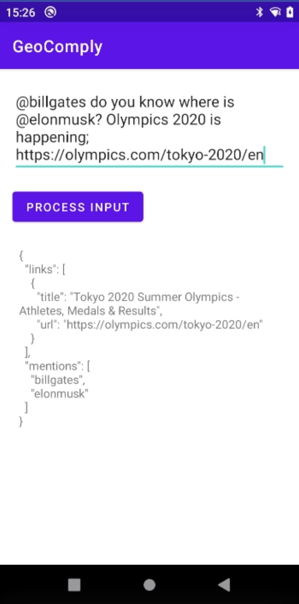

GeoComply
=================
A simple application use to extract mentions and url information from user input.

Architecture & Libraries Used
--------------

- Architecture: MVVM
- Libraries:
    * Jsoup: is a Java library for working with real-world HTML.
    * LiveData: is an observable data holder class.
    * Gson: is an open-source Java library to serialize and deserialize Java objects to JSON.

Screenshots
-----------

